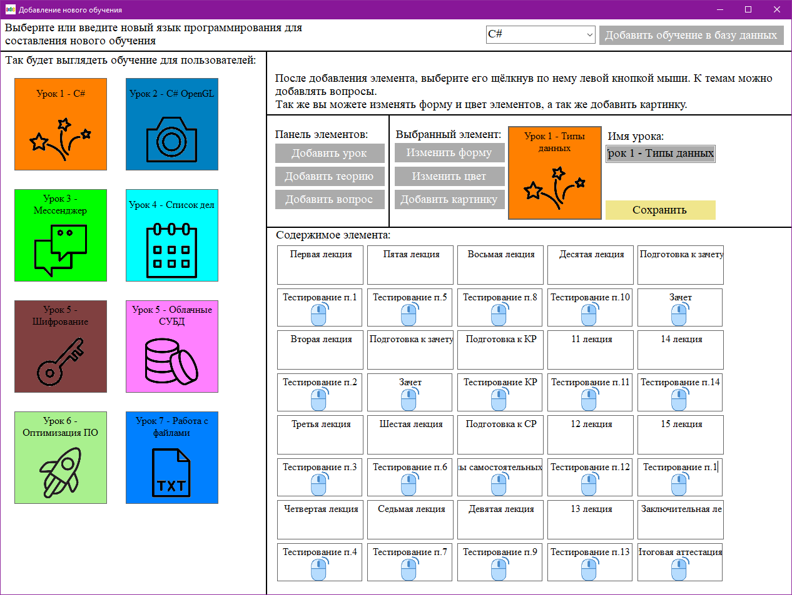
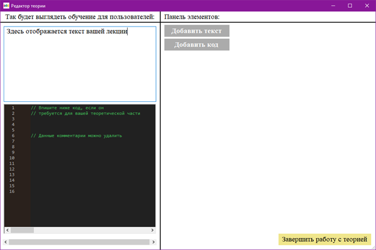
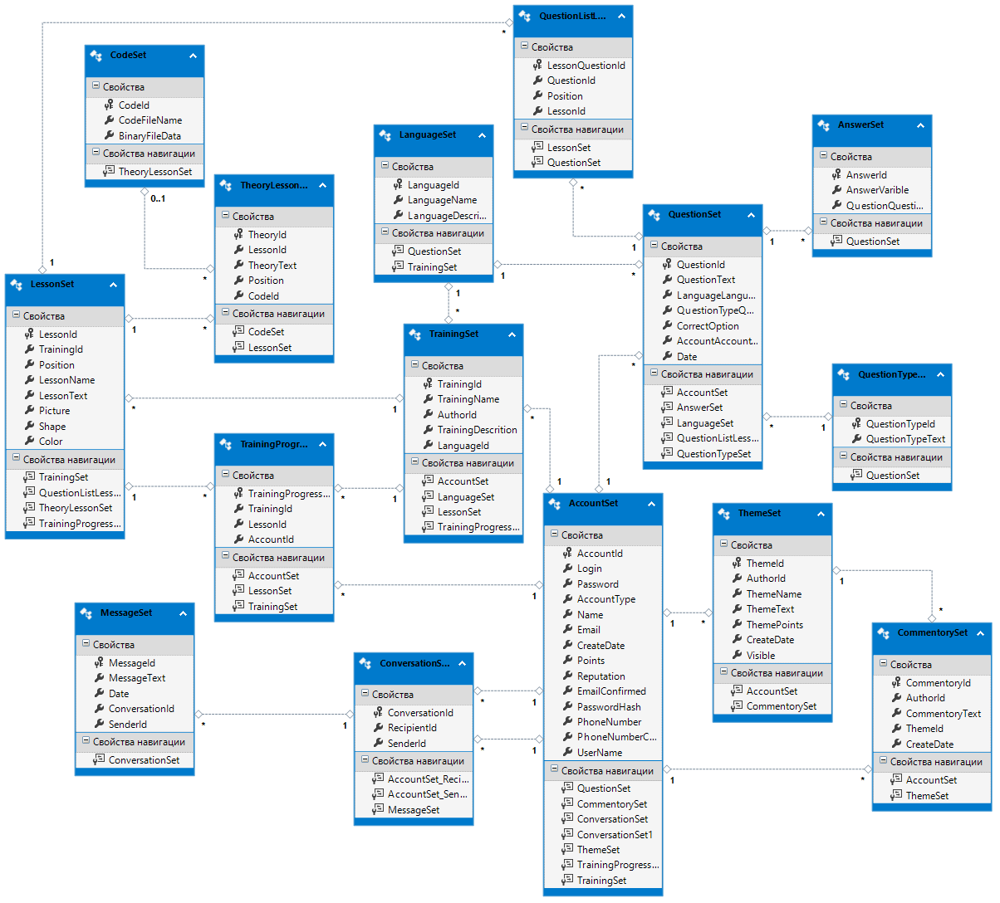
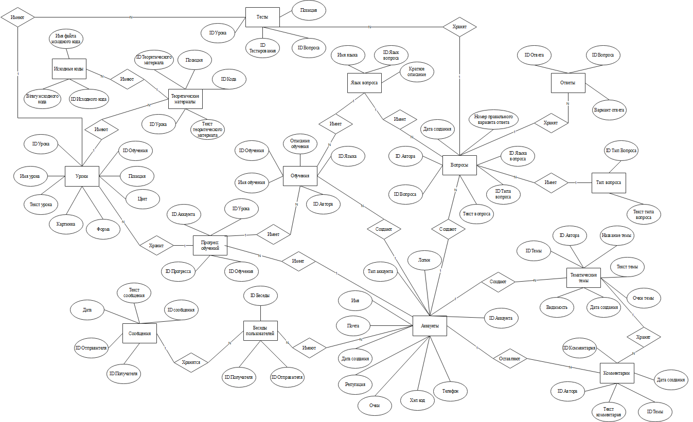
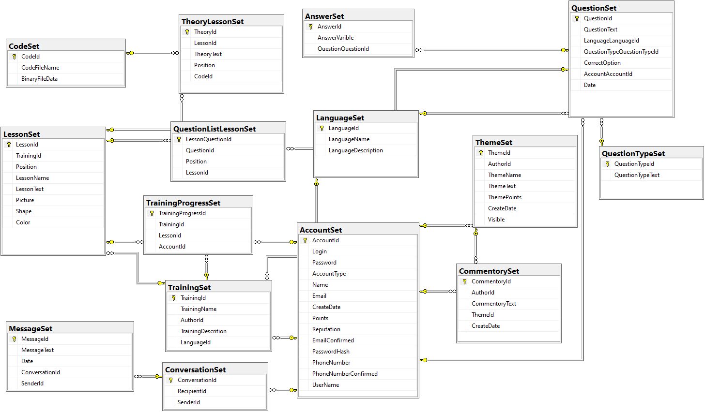

# ProgramForum

ДИПЛОМНЫЙ ПРОЕКТ - stack: c#, winforms, net framework, ms sql server, entity framework, migrations
Разработка приложения для обучения языкам программирования

Дипломный проект имеет следующие задачи:
! спроектировать и разработать простой пользовательский интерфейс, позволяющий пользователям с легкостью ориентироваться в приложении,
! разработать систему регистрации и авторизации пользователя,
! разработать систему прохождения тестов для обучения языкам программирования,
! разработать систему взаимодействия между пользователями в виде чата,
! разработать интерфейс для работы администратора приложения,
! разработать систему сбора информации для пользователей об ошибках,
! разработать систему анализа ошибок пользователей.

После решения всех поставленных задач была полностью разработана рабочая версия приложения для обучения языкам программирования, которая может быть установлена на компьютерах пользователей и быть введена в эксплуатацию.
